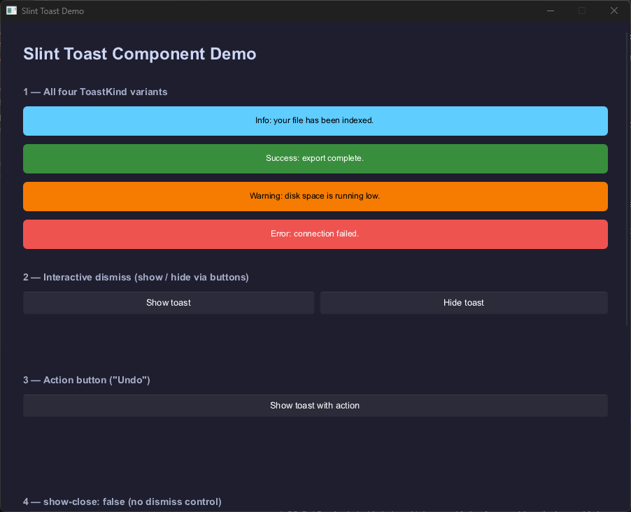

# Slint Toast Component



A toast/snackbar notification component for the [Slint](https://slint.dev) UI toolkit. Drop it into any Slint project — no timers, no queuing logic, no backend assumptions. The component handles rendering and animation; your application handles the rest.

Compatible with all Slint host languages: Rust, C++, JavaScript, and Python.

---

## Features

- Four semantic kinds: `Info`, `Success`, `Warning`, `Error`
- Six anchor positions — corners and center edges
- Optional action button with callback
- Optional icon
- Configurable close button
- Fully themeable via `ToastStyle`
- Palette-aware defaults — `Info` adapts to Fluent, Cosmic, and Material themes automatically
- WCAG AA compliant fallback colors for all kinds
- Smooth fade animation
- Accessibility roles and labels built in

---

## Getting Started

Copy the `ui/` directory into your project, then import from your `.slint` file:

```slint
import { ToastHost } from "ui/toast_host.slint";
import { ToastKind, ToastAnchor } from "ui/toast_types.slint";
```

### Minimum working example

```slint
export component AppWindow inherits Window {
    // ... all your UI content ...

    // ToastHost must be the last direct child of Window
    toast-host := ToastHost {
        anchor: ToastAnchor.BottomRight;
    }
}
```

Show a toast from anywhere in your Slint UI:

```slint
toast-host.show("File saved.", ToastKind.Success);
```

Or call it from your host language. See the [language examples](#language-examples) below.

---

## Demo

Run the interactive demo with no backend required:

```
slint-viewer demo/toast-demo.slint
```

Covers all four kinds, interactive dismiss, action button, disabled state, anchor selector, and custom `ToastStyle` override.

---

## Language Examples

Working integration examples are in [`docs/examples/`](docs/examples/):

| Language | Location |
|---|---|
| Rust | [`docs/examples/rust/`](docs/examples/rust/) |
| C++ | [`docs/examples/cpp/`](docs/examples/cpp/) |
| JavaScript | [`docs/examples/javascript/`](docs/examples/javascript/) |

Each example demonstrates calling `show()`/`hide()` from the host language, auto-dismiss via a timer, and reacting to `toast-closed` and `toast-action` callbacks.

---

## API Reference

### `ToastKind` enum

```slint
export enum ToastKind {
    Info,       // default
    Success,
    Warning,
    Error,
}
```

### `ToastAnchor` enum

```slint
export enum ToastAnchor {
    BottomRight,   // default
    BottomCenter,
    BottomLeft,
    TopRight,
    TopCenter,
    TopLeft,
}
```

### `ToastStyle` struct

All fields are optional. Zero values (`0px`, `0ms`, transparent brushes) are treated as unset and replaced with the defaults listed in the [Theming](#theming) section.

```slint
export struct ToastStyle {
    background-info:    brush,
    background-success: brush,
    background-warning: brush,
    background-error:   brush,

    foreground-info:    brush,
    foreground-success: brush,
    foreground-warning: brush,
    foreground-error:   brush,

    border-radius:      length,
    padding:            length,

    fade-in-duration:   duration,
    fade-out-duration:  duration,
    slide-duration:     duration,
}
```

### `Toast` component

The visual atom. Renders a single toast. Use this directly if you need fine-grained control; use `ToastHost` for the typical overlay use case.

**Properties**

| Property | Type | Default | Notes |
|---|---|---|---|
| `show` | `bool` | `false` | Drives show/hide and fade animation |
| `text` | `string` | `""` | Notification message |
| `kind` | `ToastKind` | `Info` | Controls color resolution |
| `enabled` | `bool` | `true` | When false, buttons are non-interactive |
| `show-close` | `bool` | `true` | Whether the close button is rendered |
| `action-label` | `string` | `""` | Empty = no action button rendered |
| `icon` | `image` | — | Optional. Detected via `icon.width > 0` |
| `style` | `ToastStyle` | — | Visual override. Zero fields use defaults |

**Callbacks**

| Callback | Fired when |
|---|---|
| `closed()` | User clicks the close button |
| `action()` | User clicks the action button |

### `ToastHost` component

The overlay container. Wraps `Toast` with anchor positioning and a command-driven interface. This is what most applications should use.

**Properties**

| Property | Type | Default | Notes |
|---|---|---|---|
| `anchor` | `ToastAnchor` | `BottomRight` | Overlay position |
| `show-close` | `bool` | `true` | Forwarded to `Toast` |
| `enabled` | `bool` | `true` | Forwarded to `Toast` |
| `action-label` | `string` | `""` | Forwarded to `Toast` |
| `icon` | `image` | — | Forwarded to `Toast` |
| `style` | `ToastStyle` | — | Forwarded to `Toast` |

**Functions**

```slint
public function show(text: string, kind: ToastKind)
public function hide()
```

`ToastHost` has no public `visible` property. Visibility is controlled exclusively by `show()` and `hide()`.

**Callbacks**

| Callback | Fired when |
|---|---|
| `toast-closed()` | User clicks the close button |
| `toast-action()` | User clicks the action button |

---

## Theming

### Default colors

| Kind | Light background | Dark background | Foreground |
|---|---|---|---|
| `Info` | `Palette.accent-background` | `Palette.accent-background` | `Palette.accent-foreground` |
| `Success` | `#2e7d32` | `#388e3c` | `#ffffff` |
| `Warning` | `#e65100` | `#f57c00` | `#000000` |
| `Error` | `#c62828` | `#ef5350` | `#ffffff` |

### Default shape and animation

| Property | Default |
|---|---|
| `border-radius` | `6px` |
| `padding` | `14px` |
| `fade-in-duration` | `180ms` |
| `fade-out-duration` | `220ms` |

### Custom style example

```slint
toast-host := ToastHost {
    anchor: ToastAnchor.BottomRight;
    style: {
        background-error:  #7f1d1d,
        foreground-error:  #fef2f2,
        border-radius:     12px,
        fade-out-duration: 300ms,
    };
}
```

---

## Placement Rules

### `ToastHost` must be the last direct child of `Window`

Slint renders children in declaration order. The last child renders on top of everything else.

```slint
export component AppWindow inherits Window {
    VerticalLayout { /* your content */ }

    // Declare ToastHost last — it will render above all other content
    toast-host := ToastHost { }
}
```

### `ToastHost` must not be nested inside a layout

Layout elements (`HorizontalLayout`, `VerticalLayout`, `GridLayout`) constrain their children to their own bounds. `ToastHost` needs to float above all content across the full window area.

```slint
// ✓ Correct — direct child of Window
toast-host := ToastHost { }

// ✗ Incorrect — will not overlay correctly
VerticalLayout {
    ToastHost { }
}
```

---

## Host Application Responsibilities

This component is a pure UI primitive. The host application is responsible for:

| Concern | How |
|---|---|
| Auto-dismiss | Own a timer; call `toast-host.hide()` on expiry |
| Toast queue | On `toast-closed()` or timer expiry, call `show()` with the next item |
| Pre-show configuration | Set `action-label`, `icon`, `style` before calling `show()` |
| Action handling | React to `toast-action()` with app-specific logic |
| Screen reader announcement | Implement supplemental logic if guaranteed announcement is required |

A minimal host implementation is around 20–30 lines in any supported language.

---

## Accessibility

| Element | `accessible-role` | `accessible-label` |
|---|---|---|
| Message text | `text` | bound to `text` |
| Close button | `button` | `"Close"` |
| Action button | `button` | bound to `action-label` |

When `enabled = false`, close and action buttons are removed from keyboard focus traversal.

**Limitations:**
- Slint does not provide an `alert` accessible role, so this component cannot guarantee proactive screen reader announcement. Applications requiring guaranteed announcement must implement supplemental logic.
- The close button label is the static English string `"Close"`. Localisation is not currently supported.

---

## Known Limitations

| Limitation | Detail |
|---|---|
| Single toast at a time | `ToastHost` owns one `Toast` — queuing is the host's responsibility |
| Screen reader announcement | No Slint `alert` role — host must supplement if needed |
| Close button label | Static English `"Close"` — not localisable via this component |
| Zero style values | `ToastStyle` cannot express zero padding or instant animations — zero is treated as unset |

---

## Contributing

Contributions are welcome. Please open an issue or discussion before submitting a pull request for anything beyond a bug fix.

All `.slint` files must pass `slint-fmt` before submitting. See [CONTRIBUTING.md](CONTRIBUTING.md) for full guidelines.

---

## License

MIT — see [LICENSE](LICENSE) for details.
